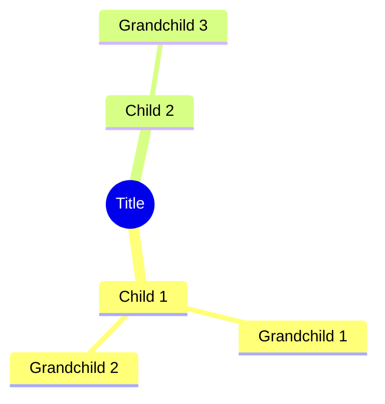

# Mind Map Formatting

## Mermaid Syntax

Mermaid mindmap requires specific indentation:
- Root: 2 spaces indent
- Children (level 1): 2 spaces indent  
- Grandchildren (level 2): 4 spaces indent
- Great-grandchildren (level 3): 6 spaces indent



## API Response Structure
Nodes are nested under `summarizations[id].v2.mindMap.nodes`:
```json
{
  "node_id": "MM_1_1",
  "parent_node_id": "MM_0_0", 
  "title": "Category Name",
  "color": "#4A90E2"
}
```

## Conversion Algorithm

1. **Build parent map**: Group nodes by `parent_node_id`
2. **Start at root**: Skip MM_0_0 (it's the abstract root)
3. **Iterate children**: For each child of MM_0_0, add at 4-space indent
4. **Recurse**: For each node, add its children at parent indent + 2
5. **Escape special characters**: Wrap node text in double quotes if it contains `()[]{}"/\`

## Escaping Special Characters

Use square brackets with double quotes around labels containing special characters:
```
- Normal: `Child Node`
- Special: `["Node with (parentheses)"]`
```

Mermaid mindmap nodes with `()` `[]` `{}` `"` `/` `\` must be wrapped in `["..."]` to avoid parsing errors.