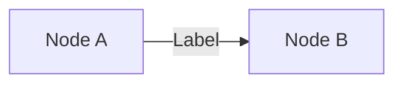
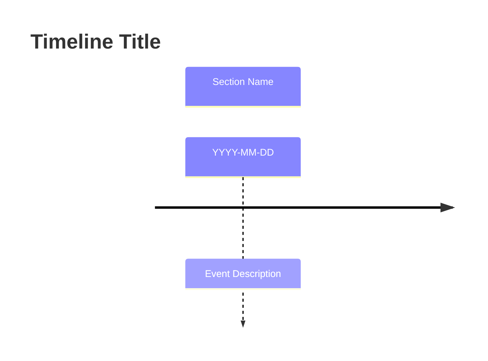

# Note Formatting

## File Location
`Recordings/YYYY-MM-DD - {Title}.md`

## YAML Frontmatter
```yaml
---
date: YYYY-MM-DD
heypocket_id: {id}
heypocket_updated_at: {timestamp}
tags: [heypocket-sync, meeting-minutes]
---
```

## Section Order (Required)

1. `# {Title}` (H1)
2. `## Mindmap` — Mermaid.js diagram (first)
3. `## Summary` — concise overview (first paragraph only)
4. `## Executive Brief` — detailed insights, subsections, key decisions, nuance

## API Response Structure
Content is nested under `summarizations[id].v2`:
```json
{
  "summarizations": {
    "{uuid}": {
      "v2": {
        "summary": { "markdown": "..." },
        "mindMap": { "nodes": [...] },
        "actionItems": { "actions": [...] }
      }
    }
  }
}
```

## Content Parsing
1. **Extract markdown** from `summarizations[].v2.summary.markdown`
2. **Strip leading headers**: Remove `### Executive Brief` (or `### ✅ Action Items`) from the start
3. **Split content**:
   - First paragraph → `## Summary`
   - Remaining content → `## Executive Brief`
4. **Preprocessing**: Strip any duplicate `### Executive Brief` headers that may appear in the Executive Brief section

## Pocket Tag Conversion (MANDATORY)

The API may return custom `<pocket:*>` tags that must be converted to Mermaid syntax:

### Flowchart
Convert `<pocket:flowchart title="...">` blocks to Mermaid flowchart:


Conversion rules:
- Parse lines in format: `NodeA ->|Label| NodeB`
- Assign sequential IDs (A, B, C...) to each unique node
- Wrap node text in square brackets: `[Node Text]`
- Preserve edge labels with `|Label|`

### Timeline
Convert `<pocket:timeline title="...">` blocks to Mermaid timeline:


Conversion rules:
- Parse lines in format: `Date | Section | Description`
- Group consecutive items with same section under `section` header
- Dates can be: `YYYY-MM-DD`, `Month Day`, `Next Week`, `Today`, etc.
- Convert to timeline syntax with proper date/event formatting